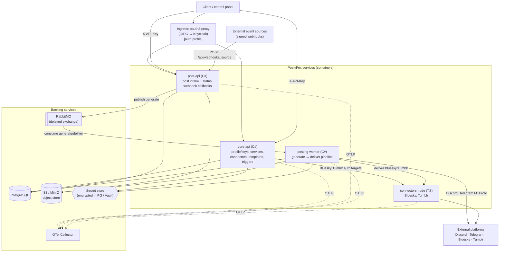
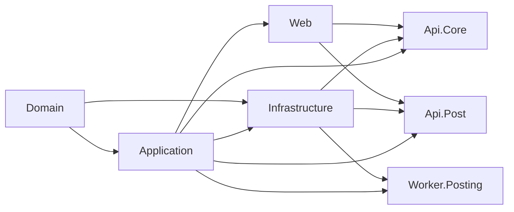
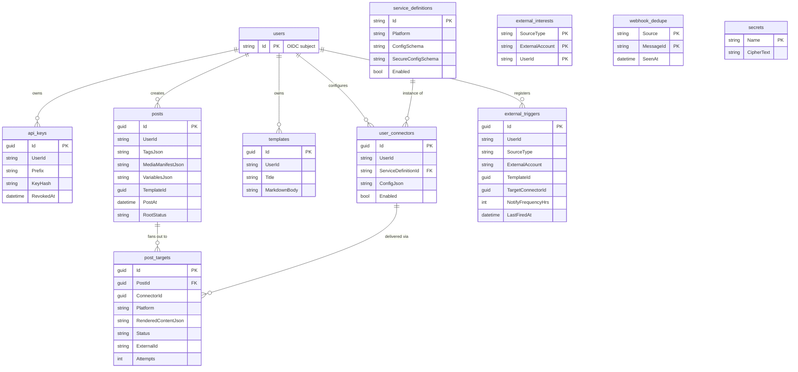
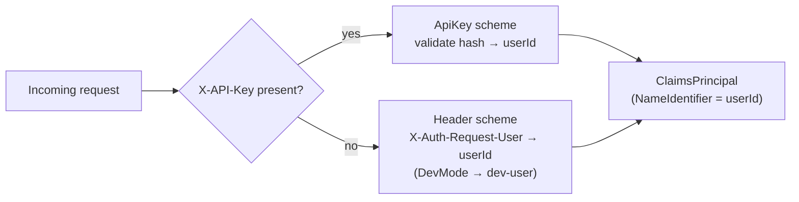
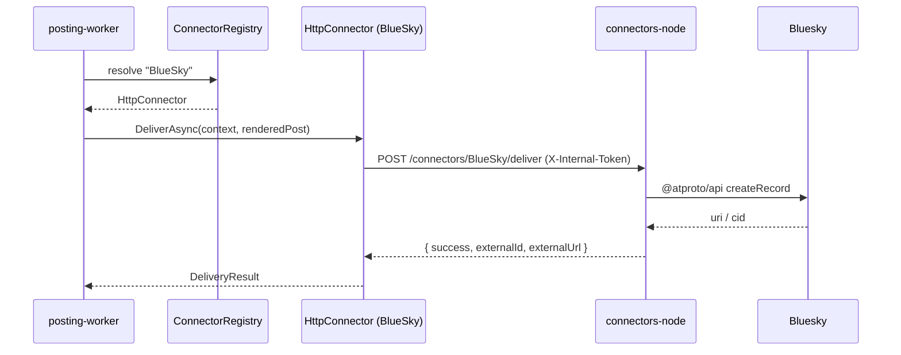
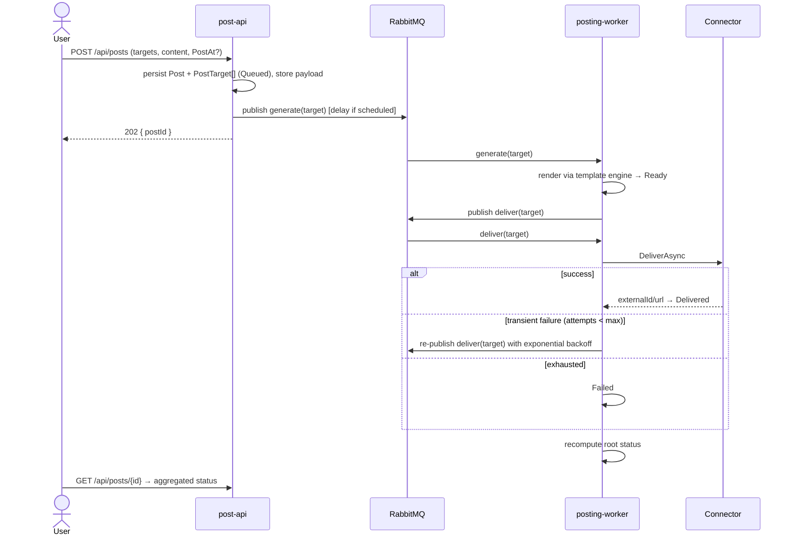
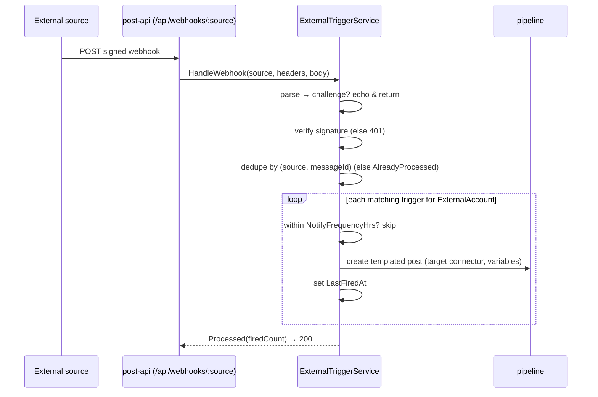

# PostyFox Platform — Architecture (as built)

This describes the **containerised reimplementation** under `platform/` as it actually exists in
code (Phases 0–4). For the original requirements/plan see
[`../../docs/REIMPLEMENTATION_PLAN.md`](../../docs/REIMPLEMENTATION_PLAN.md); for the key decisions
and their rationale see [`DECISIONS.md`](./DECISIONS.md); for operational how-to see
[`../README.md`](../README.md).

> Diagrams are Mermaid (render on GitHub).

---

## 1. Overview

PostyFox is a multi-platform social **broadcasting / cross-posting backend**. A user connects social
accounts ("connectors"), then either publishes a post that is rendered per-platform and delivered to
every selected target, or registers an **external trigger** that auto-posts when a signed inbound
event arrives. This repo is the backend + infrastructure only (the control-panel UI is separate).

### Design principles

- **Cloud-agnostic** — no hard dependency on any single cloud; every external concern (DB, object
  store, message bus, secrets, auth edge, telemetry) sits behind an abstraction with a swappable
  implementation.
- **Stateless services, async pipeline** — APIs are stateless and horizontally scalable; delivery
  is decoupled through a message bus so it scales on queue depth and survives restarts.
- **Uniform extensibility** — adding a platform means implementing one connector contract; adding an
  event source means implementing one trigger-source contract.
- **Two language stacks by fit** — C# for the bulk; Node/TypeScript only where its libraries are
  materially better (Bluesky, Tumblr), behind the same connector contract.

---

## 2. Container view

### Components

| Component | Runtime | Responsibility |
|-----------|---------|----------------|
| **core-api** | ASP.NET Core (.NET 10) | Identity/API keys, service catalogue, connector CRUD + auth/target ops, templates, trigger registration. Applies EF migrations + seeds catalogue on boot. |
| **post-api** | ASP.NET Core (.NET 10) | Post intake + status; inbound external-trigger webhook callbacks. Publishes pipeline commands. |
| **posting-worker** | .NET Worker | Consumes `generate`/`deliver` queues; renders + delivers each target; owns retries/backoff/DLQ + status rollup. |
| **connectors-node** | Node 24 / Fastify | Bluesky (`@atproto/api`) + Tumblr (`tumblr.js`) behind an `IConnector`-shaped HTTP contract; internal-token auth; stateless. |
| PostgreSQL | — | System of record. |
| S3 / MinIO | — | Media, post payloads, Telegram MTProto sessions. |
| RabbitMQ | — | Pipeline queues; delayed-message exchange for scheduling + retry backoff. |
| Secret store | — | Per-user connector secrets, platform secrets, trigger signing secrets. |
| oauth2-proxy + Keycloak | — | OIDC edge (opt-in `auth` compose profile); injects the trusted identity header. |
| OTel Collector | — | Traces + metrics sink (OTLP). |

---

## 3. Code structure (.NET solution)

Clean-architecture layering; dependencies point inward.

| Project | Contents |
|---------|----------|
| `PostyFox.Domain` | Entities + enums. No dependencies. |
| `PostyFox.Application` | Abstractions (`IAppDbContext`, `IObjectStore`, `IMessageBus`, `ISecretStore`, `IConnector`, `ITelegramGateway`, `ITriggerSource`, …), services/use-cases, template engine, pipeline handlers, connector + trigger contracts, DTOs. |
| `PostyFox.Infrastructure` | EF Core `AppDbContext` + migrations, S3 object store, RabbitMQ bus + topology, encrypted secret store, connectors (Discord, Telegram/WTelegram, `HttpConnector`), catalogue seeder. |
| `PostyFox.Web` | Shared auth handlers (header + API key) and OpenTelemetry wiring. |
| `PostyFox.Api.Core` / `PostyFox.Api.Post` | Minimal-API hosts + endpoint groups. |
| `PostyFox.Worker.Posting` | Hosts the queue consumers. |
| `tests/*` | 5 xUnit projects (91 tests). `connectors-node` has its own 15 tests. |

The `Application` layer deliberately depends on EF Core Core (`IAppDbContext` exposes `DbSet<>`),
trading a little purity for far less repository boilerplate.

---

## 4. Data model

Notes:
- **Secrets are never in domain tables.** Per-user connector secrets live in the secret store under
  `conn-{connectorId:N}-{userId}`; trigger signing secrets under `trigger-{sourceType}-signing`;
  platform secrets (e.g. `TelegramApiID`/`TelegramApiHash`) under their own names. The `secrets`
  table is the local encrypted-at-rest (AES-256-GCM) backing for `ISecretStore`; production can
  swap it for Vault/KMS.
- **Enums stored as strings** (`RootStatus`, `Status`) for readability.
- **Object store**: `post/{postId}/{title|description|description-html}`, media manifest entries, and
  `telegram/{userId}` MTProto session blobs.

---

## 5. Authentication & authorization

- A **policy scheme** (`PostyFox`) forwards to one of two handlers based on the presence of the
  `X-API-Key` header.
- **Header scheme** trusts the identity header injected by the oauth2-proxy edge (which performs the
  OIDC exchange against Keycloak). `Auth:DevMode=true` authenticates every request as `Auth:DevUserId`
  for local iteration.
- **API-key scheme** validates the presented key against a PBKDF2 hash (constant-time), for
  external/machine callers — the retained requirement. Keys are prefix-indexed; the secret is never
  stored.
- Webhook callbacks are anonymous at the auth layer and instead authenticated per-source by
  **signature verification** (see §8).

---

## 6. Connector framework

Every platform implements `IConnector`: `Describe`, `IsAuthenticatedAsync`, `ListTargetsAsync`,
`DeliverAsync`. A `ConnectorRegistry` resolves connectors by platform key. The delivery handler and
the connector-ops endpoints never hard-code a platform.

| Platform | Where it runs | Library / mechanism |
|----------|---------------|---------------------|
| Discord | C# in-process | webhook HTTP |
| Telegram | C# in-process | **MTProto user account** via `WTelegramClient`, behind `ITelegramGateway` |
| Bluesky | connectors-node | `@atproto/api` |
| Tumblr | connectors-node | `tumblr.js` |

The C# **`HttpConnector`** adapter fulfils `IConnector` for Bluesky/Tumblr by forwarding to
connectors-node over HTTP (`POST /connectors/{platform}/{is-authenticated|list-targets|deliver}`),
passing the resolved config + secret in the request body so the Node service stays **stateless**. All
internal calls carry a shared `X-Internal-Token`.

**Telegram statefulness**: MTProto login is interactive and session-based. Sessions persist to the
object store; in-progress login clients are held per-instance. Route a user's Telegram operations to
a single instance (consistent hashing / dedicated telegram-worker) — see
[`../../docs/REIMPLEMENTATION_PLAN.md`](../../docs/REIMPLEMENTATION_PLAN.md) §4.5. The MTProto work
sits behind `ITelegramGateway` so the connector and login flow are unit-tested with a fake.

---

## 7. Posting pipeline

Target states: `Queued → Generating → Ready → Delivering → Delivered | Failed`.
Root rollup: all delivered → `Delivered`; mixed terminal → `PartiallyFailed`; none delivered →
`Failed`; otherwise `Delivering`/`Generating`/`Queued`. Retry count and base backoff are configured
via `Pipeline:MaxDeliveryAttempts` / `Pipeline:RetryBaseSeconds`.

---

## 8. External-trigger framework

Source-agnostic. An `ITriggerSource` encapsulates a source's signature scheme and payload shape; a
generic HMAC-signed webhook source ships built-in (`X-Signature` = hex HMAC-SHA256 of the body,
`X-Message-Id` for dedupe).

Registration (`POST /api/triggers`) records an `external_triggers` row (source, external account,
template, target connector, frequency). Fan-out reuses the normal posting pipeline, so triggered
posts get the same rendering, delivery, retry and status behaviour.

---

## 9. Messaging topology

- One durable **`x-delayed-message`** exchange (`postyfox`, delegate type `direct`) — the delay
  header powers both scheduled posts and retry backoff.
- Queues `generate` and `deliver`, each bound by routing key = queue name, each dead-lettering to
  `postyfox.dlx` → `{queue}.dlq`.
- Publisher declares the queue before publishing so messages aren't lost if the worker is down.
- Consumers ack on success; an unhandled exception nacks → DLQ (per-target *delivery* retries are
  handled in the pipeline handler via delayed re-publish, not transport requeue).

---

## 10. Observability, deployment, testing

- **Observability**: OpenTelemetry traces + metrics exported via OTLP (`OTEL_EXPORTER_OTLP_ENDPOINT`)
  to any collector/backend. `/healthz` (liveness) and `/readyz` (DB connectivity) on both APIs.
- **Security hardening**: a global fixed-window **rate limiter** (config-driven, partitioned by
  user/IP, HTTP 429) and conservative **security response headers** on both APIs.
- **Deployment** — three modes, all consuming the same published images
  (`{registry}/{repository}-{service}:{tag}`):
  1. **docker-compose** (`platform/deploy/docker-compose.yml`) — full local stack; `auth` profile
     adds Keycloak + oauth2-proxy.
  2. **Helm chart** (`platform/deploy/helm/postyfox`) — the 4 services + config/secret/ingress for
     any Kubernetes; backing services provided externally.
  3. **Terraform → Azure Container Apps** (`platform/deploy/terraform-aca`) — deploys the published
     images to ACA (external ingress for the APIs, internal for connectors-node, no ingress for the
     worker).

  One templated `Dockerfile` builds each .NET service (build args select project + assembly);
  connectors-node has its own multi-stage Dockerfile. CI (`.github/workflows/platform-ci.yml`)
  builds + tests both stacks, lints the IaC, and builds/pushes images.
- **Config**: 12-factor env vars, nested with `__` (see [`../README.md`](../README.md#configuration-env-vars)).
- **Testing**: unit + integration tests per layer using in-memory SQLite / EF-InMemory and fakes for
  I/O — no Docker required. The pipeline is covered end-to-end via an in-process bus that drives the
  real handlers. Not covered: the live MTProto gateway and the live external-platform calls (need
  real credentials) — the logic around them is tested via seams.

---

## 11. Known constraints & follow-ups

See [FOLLOWUPS.md](./FOLLOWUPS.md) for the full list. Headlines:

- **🔴 Media delivery is deferred** — the pipeline carries a media manifest end-to-end but no
  connector uploads media yet (text-only delivery). This is a **key product requirement** and the
  next work item.
- Telegram MTProto is stateful (single-writer routing) and not integration-tested (needs live creds).
- No admin endpoint yet for platform-level secrets (Telegram api id/hash, trigger signing secrets).
- Scheduling relies on the RabbitMQ delayed-message plugin; a durable scheduler is a follow-up.
- Twitch was **descoped** and is intentionally absent.
